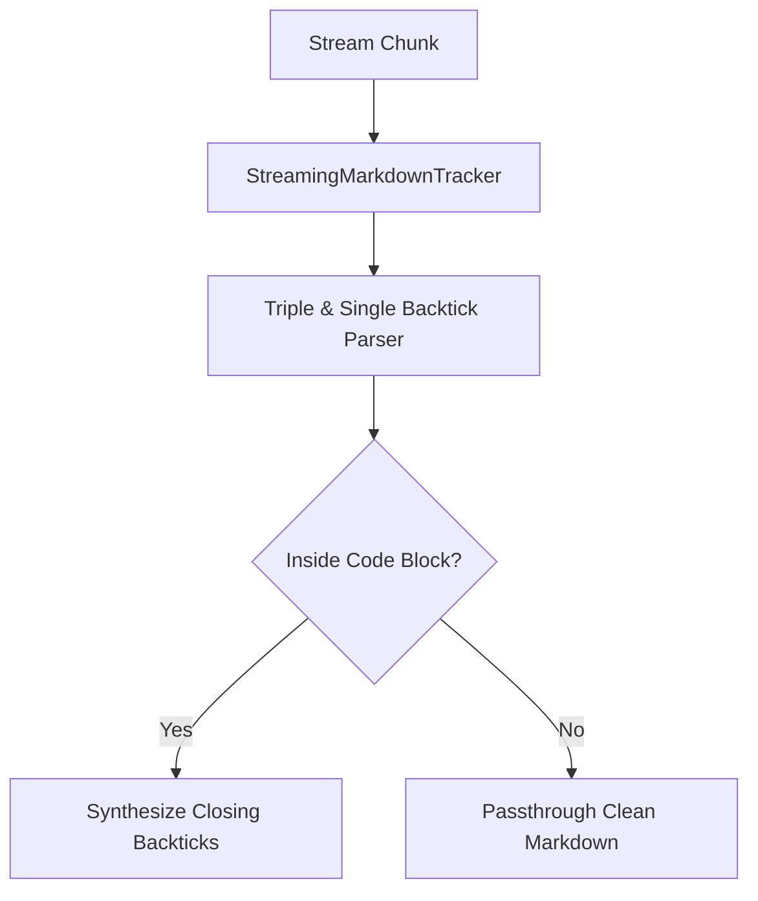

# genpark-streaming-markdown-code-block-tracker-skill

Real-time state machine tracking unclosed markdown code fences, language tags, and formatting delimiters to prevent broken rendering in streaming chat interfaces.

## Architecture

## Features
- **Auto-Closure Synthesis**: Guarantees syntax highlighters always receive closed code blocks.
- **Language Detection**: Extracts programming language specifiers.
- **Pure Python**: 100% Standard Library.
